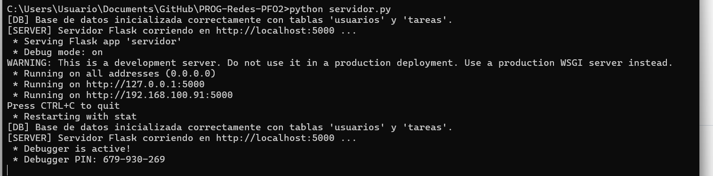
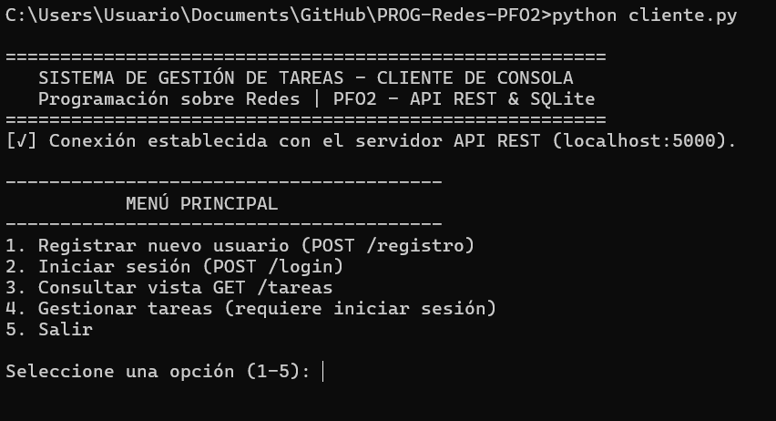
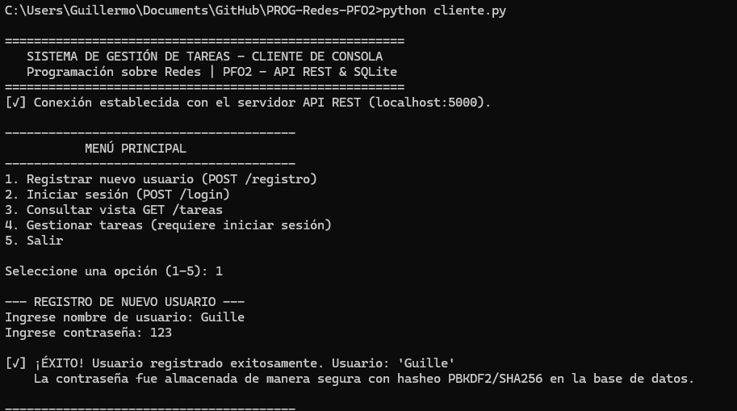
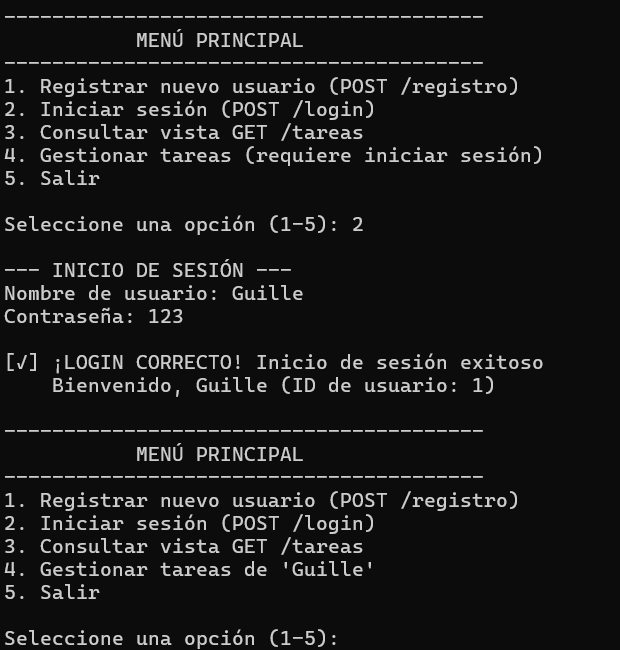
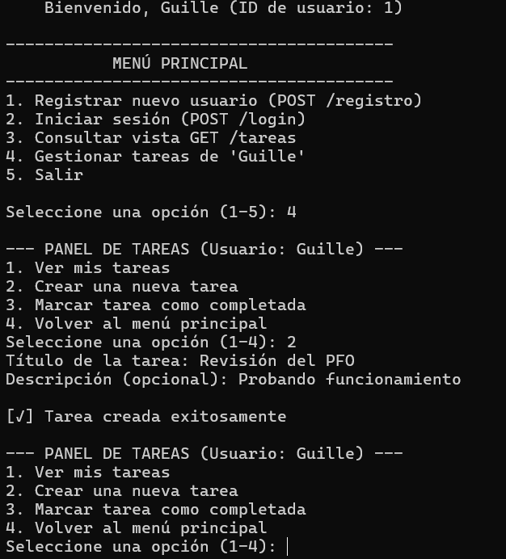
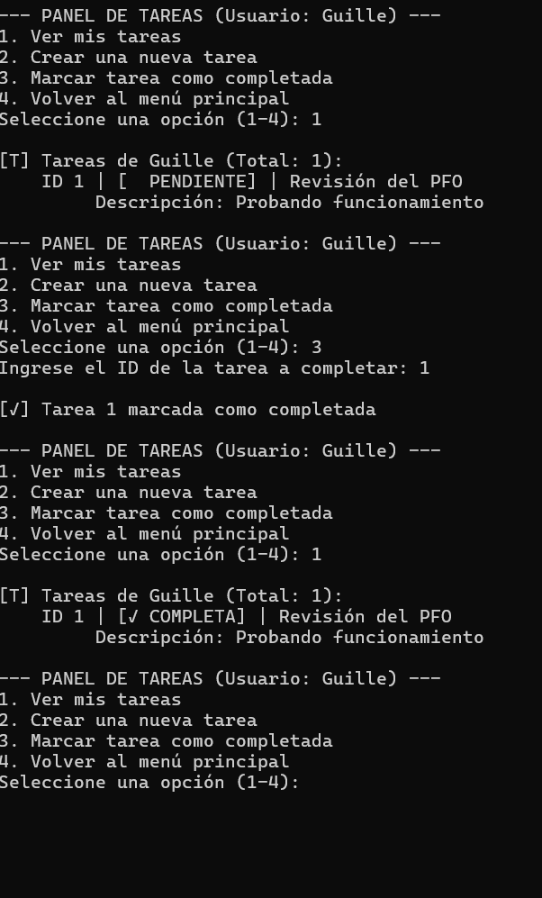
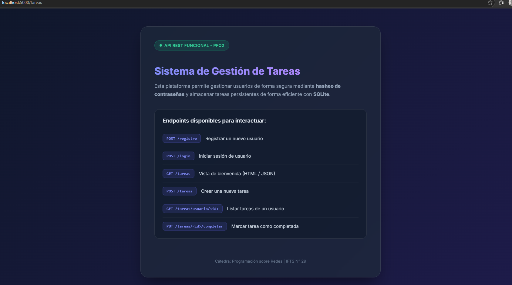
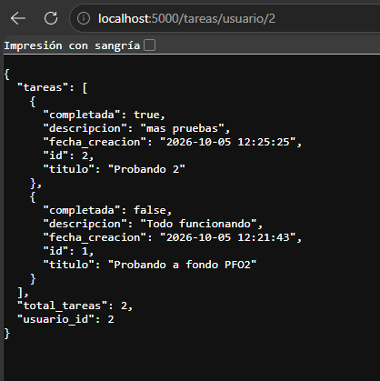

# Práctica Formativa Obligatoria 2 (PFO 2)
## Sistema de Gestión de Tareas con API REST, SQLite y Autenticación de Usuarios

**Materia:** Programación sobre Redes  
**Profesor:** Alan Portillo  
**Carrera:** Tecnicatura Superior en Desarrollo de Software (IFTS N° 29)  
**Comisión:** D
**Alumno:** Sciulli Guillermo Miguel

---

## 📌 Descripción del Proyecto

Este trabajo práctico consiste en el desarrollo de un sistema completo **Cliente-Servidor** para la gestión de usuarios y tareas mediante una **API REST construida en Python con Flask** y persistencia en una base de datos **SQLite**.

El servidor implementa medidas de ciberseguridad clave como el **hasheo seguro de contraseñas** utilizando funciones criptográficas (`PBKDF2` con `SHA256` y sal única) mediante la librería `werkzeug.security`. Por su parte, el cliente es una **aplicación interactiva de consola** en Python que permite consumir los endpoints de la API en tiempo real.

---

## 🛠️ Arquitectura y Tecnologías Utilizadas

- **Servidor API REST (`servidor.py`)**: Desarrollado en Python 3 con **Flask**.
- **Base de Datos Persistente (`tareas.db`)**: Motor **SQLite3**.
- **Seguridad y Hasheo**: Módulo `werkzeug.security` (`generate_password_hash`, `check_password_hash`).
- **Cliente Consola (`cliente.py`)**: Desarrollado en Python 3 utilizando la librería `requests`.

---

## 🚀 Guía de Instalación y Ejecución

### Prerrequisitos

El proyecto utiliza librerías estándar de Python y el paquete `requests` para el cliente HTTP:

```bash
pip install flask requests
```

---

### Pasos para Ejecutar y Probar el Proyecto

#### 1. Iniciar el Servidor API REST
Abre una terminal en el directorio del proyecto y ejecuta:

```bash
python servidor.py
```

*Respuesta esperada en consola:*
```text
[DB] Base de datos inicializada correctamente con tablas 'usuarios' y 'tareas'.
[SERVER] Servidor Flask corriendo en http://localhost:5000 ...
```
*(Nota: El servidor creará automáticamente el archivo `tareas.db` en su primera ejecución).*

---

#### 2. Iniciar el Cliente de Consola
Abre una **segunda terminal** en el mismo directorio y ejecuta:

```bash
python cliente.py
```

---

## 📋 Endpoints de la API REST

| Método | Endpoint | Descripción | Formato Entrada / Payload |
| :--- | :--- | :--- | :--- |
| `POST` | `/registro` | Registro de nuevos usuarios con contraseña hasheada | `{"usuario": "nombre", "contraseña": "1234"}` |
| `POST` | `/login` | Verificación de credenciales y autenticación | `{"usuario": "nombre", "contraseña": "1234"}` |
| `GET` | `/tareas` | Muestra vista HTML de bienvenida o estado JSON | N/A (Header `Accept: application/json` opcional) |
| `POST` | `/tareas` | Crear una nueva tarea vinculada a un usuario | `{"usuario_id": 1, "titulo": "Aprender Flask", "descripcion": "..."}` |
| `GET` | `/tareas/usuario/<id>` | Obtener el listado de tareas de un usuario | N/A |
| `PUT` | `/tareas/<id>/completar` | Marcar una tarea específica como completada | N/A |

---

## 📸 Secuencia de Prueba Exitosa

1. **Registro**: Desde la Opción 1 del cliente, registra un usuario (ej. usuario: `alan`, contraseña: `secretpassword123`).
2. **Login**: Desde la Opción 2 del cliente, inicia sesión con las credenciales registradas. El servidor validará el hash y retornará el `usuario_id`.
3. **Consulta GET /tareas**: Selecciona la Opción 3 para verificar la respuesta del endpoint `/tareas` en consola o abre `http://localhost:5000/tareas` en tu navegador preferido.
4. **Gestión de Tareas**: Selecciona la Opción 4 para crear, listar y marcar tareas como completadas asociadas a tu usuario.

---

## 📸 Capturas de Pantalla de Pruebas Exitosas

Las capturas de pantalla que demuestran el funcionamiento correcto del sistema se encuentran organizadas en la carpeta `img/`:

### 1. Inicio del Servidor Flask e Inicialización de la Base de Datos


### 2. Conexión de cliente


### 3 Registro de Usuario 


### 4. Inicio de Sesión y Autenticación de Credenciales


### 5. Vista de Bienvenida HTML y gestión de tareas


### 6. Ver Tareas 


### 7. Vista HTML 


### 8. Vista tareas web

---

## 💡 Respuestas Conceptuales Exigidas en la Consigna

### 1. ¿Por qué es fundamental hashear contraseñas?

- **Importancia del Hasheo de Contraseñas y Uso de Sal (Salt)**
El almacenamiento de contraseñas en formato de texto plano representa una vulnerabilidad de seguridad crítica en el diseño de software. En el servidor desarrollado, la protección del vector de autenticación se fundamenta en la función criptográfica unidireccional de la librería 'werkzeug.security' (implementada mediante el algoritmo PBKDF2 con SHA256 y sal dinámica).
- **Mitigación ante Filtraciones de Datos (Data Leaks):** Si la base de datos SQLite 'tareas.db' fuera comprometida por un atacante, las contraseñas reales de los usuarios no se verían expuestas. El atacante únicamente obtendría cadenas aleatorias no invertibles.
- **Irreversibilidad Criptográfica:** Una función de hash es un algoritmo matemático de una sola vía. No existe una función inversa que permita 'deshashear' la cadena almacenada para recuperar la clave original.
- **Inmunidad contra Tablas Rainbow y Diccionarios (Salt):** El método de Werkzeug incorpora de forma transparente un valor aleatorio único de 'sal' (salt) antes de aplicar el hasheo. Esto garantiza que dos usuarios con la misma clave (ej: '123456') generen hashes completamente distintos en la base de datos, anulando la efectividad de ataques con tablas precalculadas.
- **Cumplimiento del Principio de Menor Privilegio:** La arquitectura garantiza que ni siquiera los administradores de la base de datos o desarrolladores del sistema conozcan las contraseñas originales de los usuarios.


---

### 2. Ventajas de usar SQLite en este proyecto

- **Ventajas Técnicas de SQLite en Arquitecturas Web Ligeras**
SQLite es el motor de base de datos relacional sin servidor (serverless) más utilizado en la industria. Para este proyecto de gestión de tareas, su elección ofrece claras ventajas arquitectónicas frente a motores cliente-servidor tradicionales como MySQL o PostgreSQL:
- **Arquitectura Embebida (Serverless):** No requiere la instalación, configuración ni mantenimiento de un servicio de proceso independiente escuchando en un puerto de red. La base de datos reside directamente en el mismo espacio de memoria del proceso de Python.
- **Almacenamiento Portátil en Archivo Único:** Toda la estructura relacional (tablas 'usuarios' y 'tareas', índices y restricciones de integridad) se empaqueta en el archivo físico 'tareas.db', garantizando máxima portabilidad entre entornos.
- **Cero Configuración (Zero-Configuration):** Se conecta nativamente mediante el módulo estándar 'sqlite3' de Python, eliminando la necesidad de credenciales complejas o cadenas de conexión de red.
- **Transacciones ACID Completas:** Cumple rigurosamente con los principios de Atomicidad, Consistencia, Aislamiento y Durabilidad, protegiendo la integridad de las relaciones entre usuarios y tareas ante fallos o apagados repentinos.

